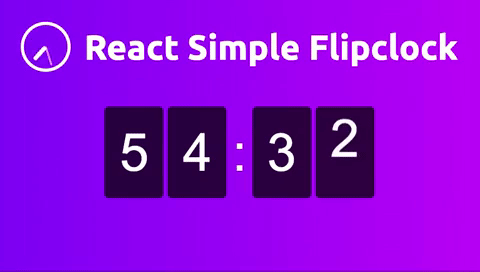

# react-simple-flipclock

A very simple Flip Clock component created by using CSS animation and React

## Table of Contents

- [Installation](#installation)
- [Usage](#usage)

## Demo


Link to demo: https://react-simple-flipclock.surge.sh

## Installation

```
npm i react-simple-flipclock --save
```

## Usage

Import Flip Clock component into your React component

```
import * as React from "react";
import ReactDOM from "react-dom";
import Flipclock from "react-simple-flipclock";

class App extends React.Component {
  render() {
    return (
      <Flipclock 
        seconds={12 * 24 * 60 * 60} // Days up to 365 days
        dark={true} // Optional for dark theme
        fontSize={30} // Optional font size
    />
    );
  }
}

ReactDOM.render(<App />, document.getElementById("root"));

```
